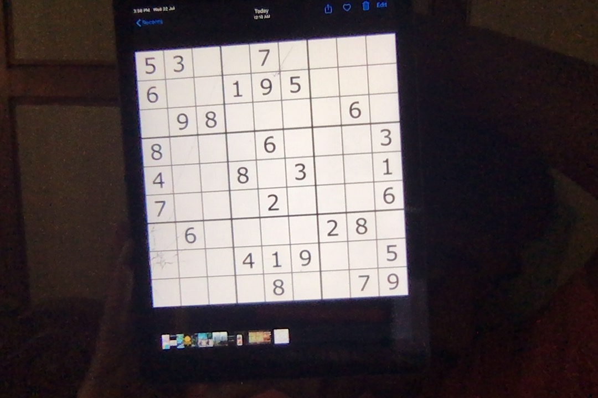
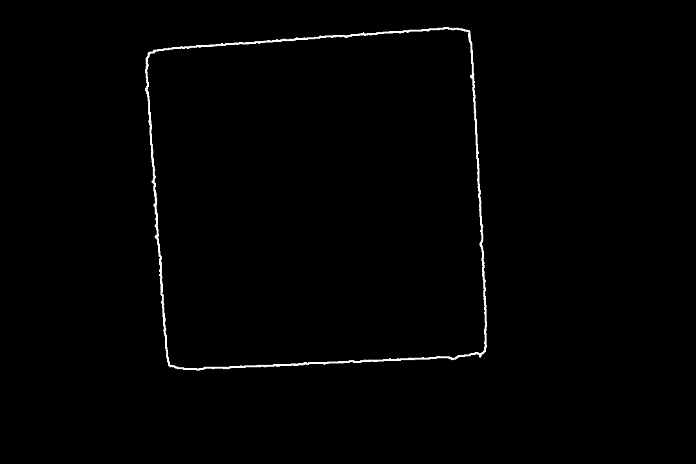
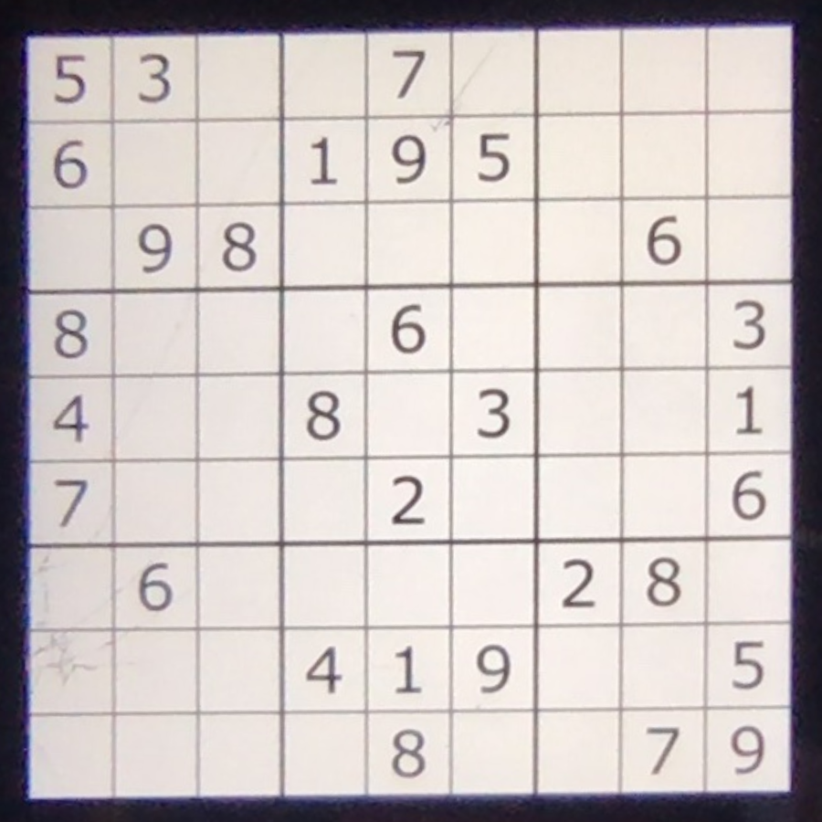
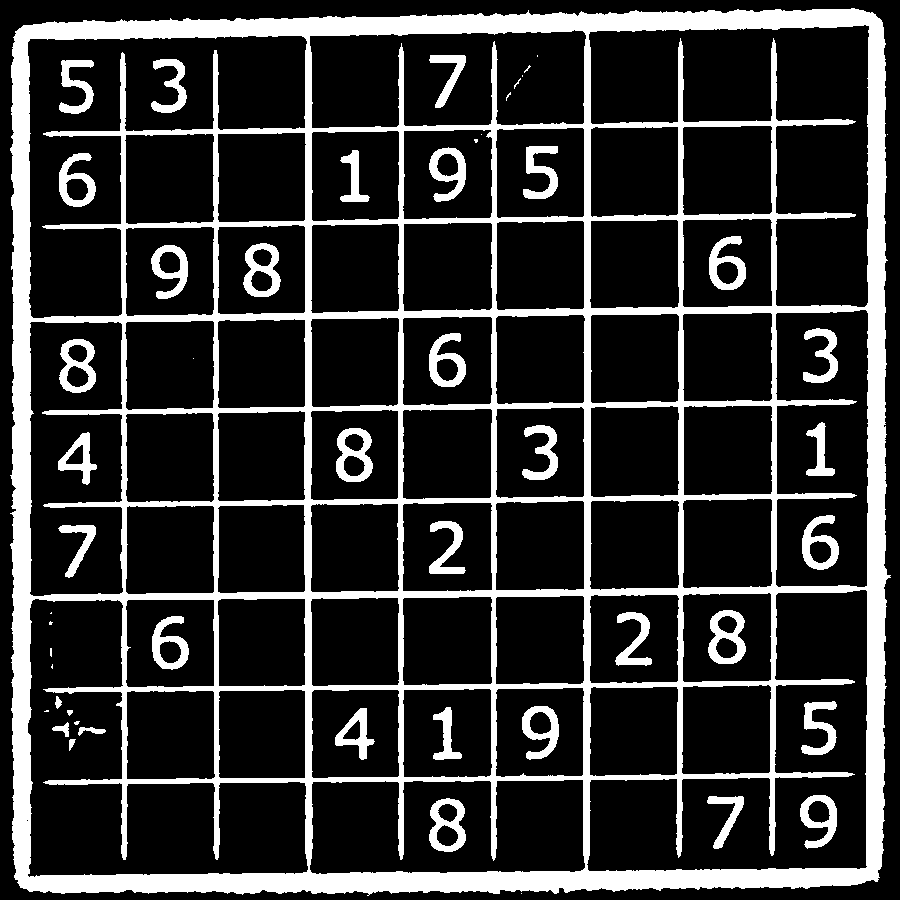
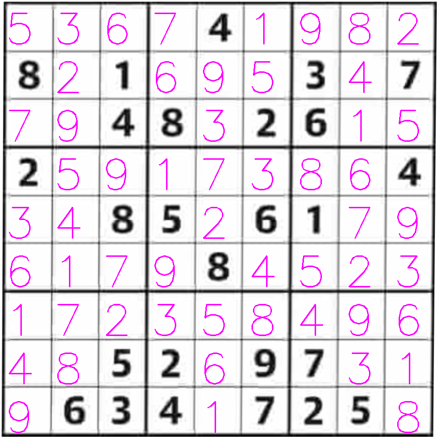
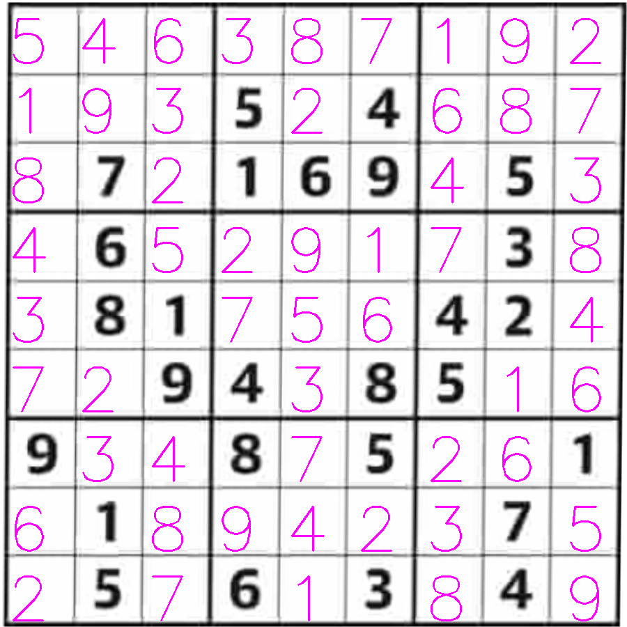
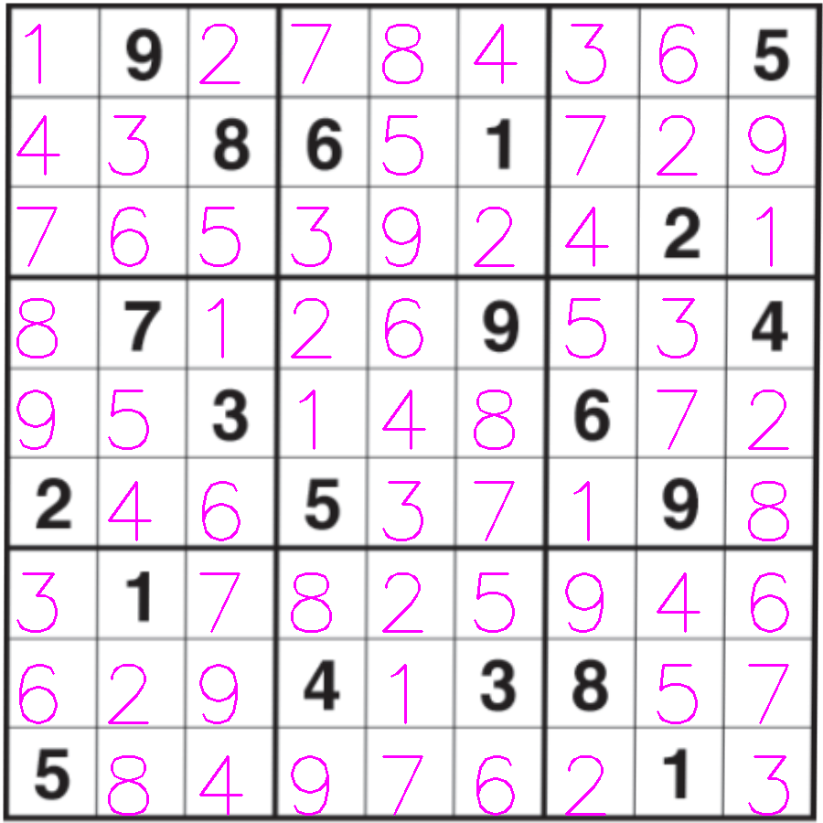

# Sudoku-CNN
Sudoku solver using CNN

The main aim of the project is to create a **Convolution Neural Network** from scratch to detect and recognise digits in Sudoku grid. 
The recognised digits are then passed into sudoku solving algorithm published by Norvig. The solution is then mapped back into the grid.
This project is done in python language.

---

The accuracy of the CNN model used to detect digits is ~98%. Hence in some cases of misclassification of digits, we may not obtain the solution

---
## Libraries used
- OpenCV
- Tensorflow
- Numpy
---

## Description of the deep learning model

The deep learning model comprises of two **Convolution** layers used to detect features, each followed by **Max Pooling** to downsample the image.  
**Relu** activation was used after each convolution.  
The output from the final Max pooling is then flattened and fed into a **Dense neural network** consisting of 3 layers activated by **relu** with 128, 64 and 32 neurons respectively.  
The final layer has 10 neurons which correspond to 10 digits that need to be predicted. **Softmax** is applied on the final layer.  

**Categorical crossentropy** is used for loss calculation and **Adam optimizer** is used for optimization of weights.  

---

Training data is custom curated, which was created using images of different digits obtained from Google images.  
**ImageDataGenerator** of Keras API was used to load the training data into the Neural net.

---
## Work Flow

**OpenCV** was used to locate sudoku block. Various transformations are applied with OpenCV to obtain the sudoku block properly.

Original image:  
</img>

After obtaining the largest contour:  
</img>

Obatining the border:  
</img>

From the border, we transform perspective and get warped image:  
</img>

Adaptive thresholding is applied to get proper input:  
</img>

* The output obtained is divided into 81 equal squares.  
* Each square is then fed into the **CNN model** created with custom data to predict the digit in the square.  
* The deep learning model predicts and produces the predictions as a string which are then fed into the sudoku solving algorithm.  
* The sudoku solving algorithm produces the solution as string.  
* The solution string is then mapped into the image with the help of **OpenCV** and **Numpy**.

---
## Usage
'python3 Sudoku.py'  
The program asks for input image name. It has some sample images which can be used for prediction, their names being 1 to 6 repectively.
Hence giving a number between 1-6 gives solution for one of the sample image.

---
## Samples of output of the program:

</img>
</img>
</img>
---
## Working

--
The algorithm used for solving sudoku is published by Peter Norvig of MIT University and the source can be found here:  
https://norvig.com/sudoku.html

